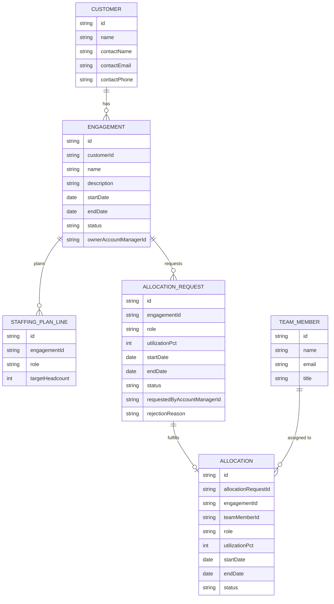

# Domain Model

The core entities behind customers, engagements, allocation requests, allocations, and team members.

- `ENGAGEMENT.status` is `Active` or `Closed`.
- `ALLOCATION_REQUEST.status` is `Pending`, `Approved`, or `Rejected`.
- `ALLOCATION.status` tracks whether an assignment is currently active or has ended.
- An `ALLOCATION` optionally traces back to the `ALLOCATION_REQUEST` it fulfilled.

