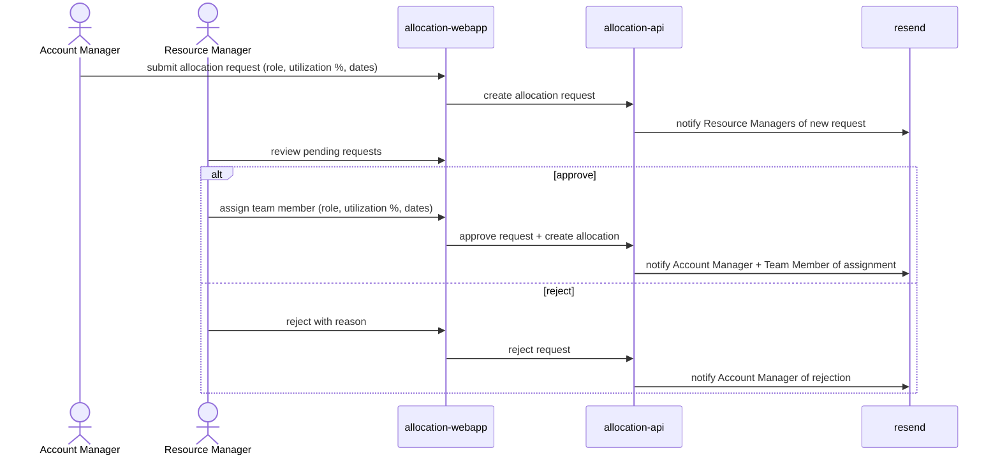

# Submit and Approve an Allocation Request

An Account Manager raises a staffing need on their engagement; a Resource Manager reviews it and either assigns a team member or rejects it, with email notifications at each step.

