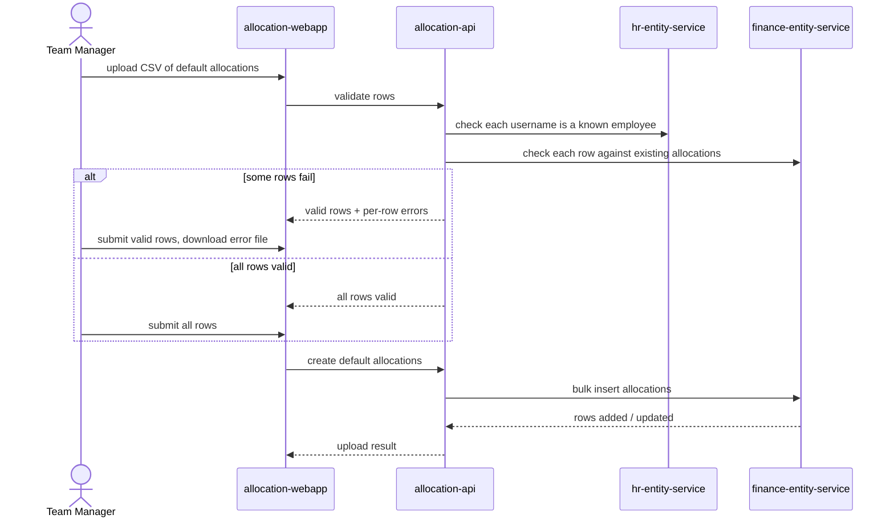

# Bulk-upload a team's default allocations

A Team manager uploads a CSV of default allocations, sees which rows fail and why, and submits the rest. (F5)

```mermaid
sequenceDiagram
    actor Manager as Team Manager
    participant allocation-webapp
    participant allocation-api
    participant hr-entity-service
    participant finance-entity-service

    Manager->>allocation-webapp: upload CSV of default allocations
    allocation-webapp->>allocation-api: validate rows
    allocation-api->>hr-entity-service: check each username is a known employee
    allocation-api->>finance-entity-service: check each row against existing allocations
    alt some rows fail
        allocation-api-->>allocation-webapp: valid rows + per-row errors
        Manager->>allocation-webapp: submit valid rows, download error file
    else all rows valid
        allocation-api-->>allocation-webapp: all rows valid
        Manager->>allocation-webapp: submit all rows
    end
    allocation-webapp->>allocation-api: create default allocations
    allocation-api->>finance-entity-service: bulk insert allocations
    finance-entity-service-->>allocation-api: rows added / updated
    allocation-api-->>allocation-webapp: upload result
```