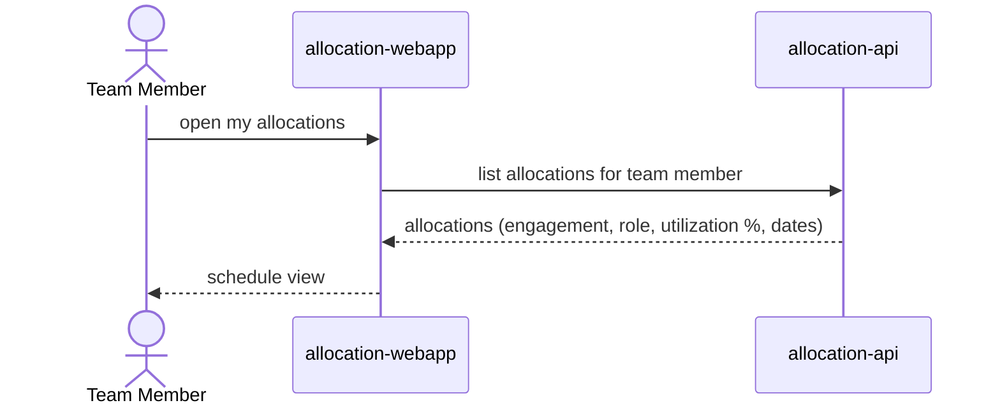

# Team Member Views Allocations

A Team Member checks their own current and upcoming allocations across engagements.

```mermaid
sequenceDiagram
    actor TeamMember as Team Member
    participant webapp as allocation-webapp
    participant api as allocation-api

    TeamMember->>webapp: open my allocations
    webapp->>api: list allocations for team member
    api-->>webapp: allocations (engagement, role, utilization %, dates)
    webapp-->>TeamMember: schedule view
```

